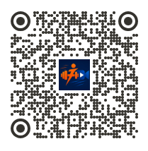

# 🏋️‍♂️ FitLive AI  
### Videoconferência Inteligente para Treinos Personalizados

## 📌 Descrição do Projeto

O **FitLive AI** é um aplicativo Android que integra videoconferência em tempo real com recursos inteligentes para treinos físicos personalizados. Utilizando o SDK do Jitsi Meet e suporte da Manus AI no desenvolvimento, o app resolve um problema comum no mercado fitness: a dificuldade de acompanhamento remoto eficiente entre treinadores e alunos.

A solução vai além de uma simples chamada de vídeo — ela oferece uma **experiência interativa**, com:

- ⏱️ Cronômetro integrado ao treino  
- 🔢 Contador de repetições  
- 🎯 Interface focada em usabilidade durante exercícios  
- 🤖 Apoio de IA no desenvolvimento  

---

## 💡 Proposta de Valor

Diferente de apps genéricos de videoconferência, o **FitLive AI** é especializado em **treinos ao vivo**, permitindo que personal trainers acompanhem seus alunos com ferramentas específicas para performance.

✔ Interface otimizada para exercícios  
✔ Redução de distrações durante chamadas  
✔ Acompanhamento mais preciso e motivador  
✔ Ideal para personal trainers e treinos remotos  

---

## 🛠️ Tecnologias Utilizadas

- Kotlin (Android)
- Jitsi Meet SDK (videoconferência open-source)
- Manus AI (assistência no desenvolvimento)
- Firebase (opcional)
- Jetpack Compose / Material Design

---

## 📱 Funcionalidades

- 📹 Criação e entrada em salas de treino  
- ⏱️ Cronômetro integrado  
- 🔢 Contador de repetições  
- 👥 Interação em tempo real (treinador ↔ aluno)  
- 🎨 Interface simples e intuitiva
  
## Link Projeto

- https://manus.im/app-preview/FEUMQKFreWigGwGpquErwW?sessionId=4U8HzOjk2CzAn01UInzNNm

## Preview

-

-
